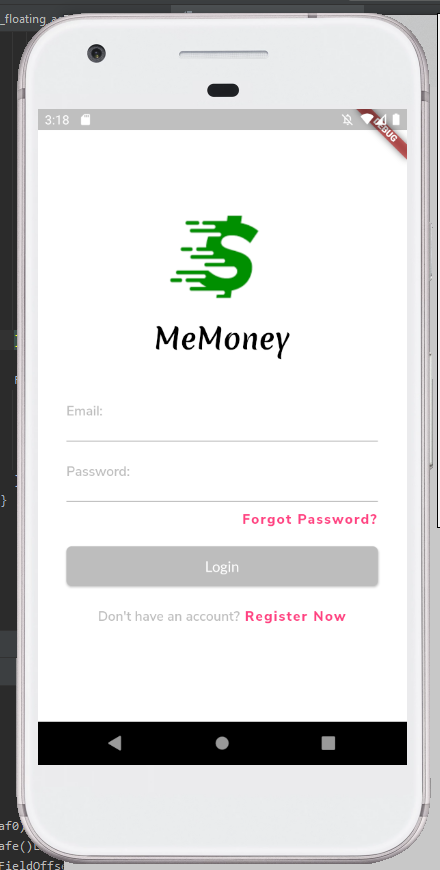
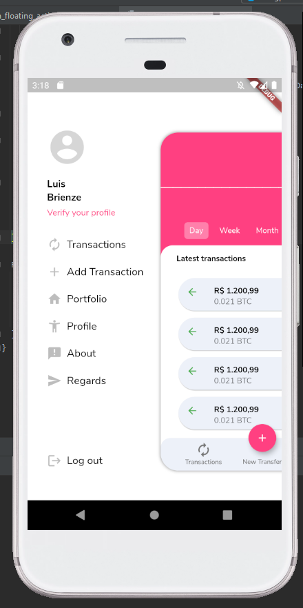

<!-- PROJECT SHIELDS -->
<!--
*** I'm using markdown "reference style" links for readability.
*** Reference links are enclosed in brackets [ ] instead of parentheses ( ).
*** See the bottom of this document for the declaration of the reference variables
*** for contributors-url, forks-url, etc. This is an optional, concise syntax you may use.
*** https://www.markdownguide.org/basic-syntax/#reference-style-links
-->
[![LinkedIn][linkedin-shield]][linkedin-url]

<!-- PROJECT LOGO -->
<br />
<div align="center">
  <a href="https://gitlab.com/brienze1/planinha-de-gastos-automatizada">
    
  </a>

  <div align="center">
    <h3 >Planilha de Gastos Automatizada</h3>
  </div>

  <div align="center">
    An awesome README template to jumpstart your projects!
    <br />
    <a href="https://gitlab.com/brienze1/planinha-de-gastos-automatizada"><strong>Explore the docs »</strong></a>
    <br />
    <br />
    <a href="https://github.com/othneildrew/Best-README-Template">View Demo</a>
    ·
    <a href="https://gitlab.com/brienze1/planinha-de-gastos-automatizada/issues">Report Bug</a>
    ·
    <a href="https://gitlab.com/brienze1/planinha-de-gastos-automatizada/issues">Request Feature</a>
  </div>
</div>


<!-- TABLE OF CONTENTS -->
<details open="open">
  <summary>Table of Contents</summary>
  <ol>
    <li>
      <a href="#about-the-project">About The Project</a>
      <ul>
        <li><a href="#built-with">Built With</a></li>
      </ul>
    </li>
    <li>
      <a href="#getting-started">Getting Started</a>
      <ul>
        <li><a href="#prerequisites">Prerequisites</a></li>
        <li><a href="#installation">Installation</a></li>
      </ul>
    </li>
    <li><a href="#usage">Usage</a></li>
    <li><a href="#roadmap">Roadmap</a></li>
    <li><a href="#contributing">Contributing</a></li>
    <li><a href="#license">License</a></li>
    <li><a href="#contact">Contact</a></li>
    <li><a href="#acknowledgements">Acknowledgements</a></li>
  </ol>
</details>


<!-- ABOUT THE PROJECT -->
## About The Project
<div align="center">
  <a href="https://gitlab.com/brienze1/planinha-de-gastos-automatizada">
    
    
  </a>
</div>
  <br />

MeMoney is an app designed to store your monetary transactions and help you realize where your money goes to. 

Some implemnted features:
* Account registration
* Account login
* Auto login (when configured in app)
* Store transactions
* Visualize transaction graphs

At the begining the features implemented will be focussed in basic functions and will increase it's functionalities as time goes by. So I'll be adding more in the near future. You may also suggest changes by forking this repo and creating a pull request or opening an issue. 

A list of commonly used resources that I find helpful are listed in the acknowledgements.

### Built With

This section should list any major frameworks that you built your project using. Leave any add-ons/plugins for the acknowledgements section. Here are a few examples.
* [Java 14](https://www.oracle.com/java/technologies/javase/14-relnote-issues.html)
* [Spring Boot](https://spring.io/projects/spring-boot)
* [Clean Architechture](https://www.baeldung.com/spring-boot-clean-architecture)

<!-- GETTING STARTED -->
## Getting Started

To get a local copy up and running follow these simple example steps.

### Prerequisites

* Download Java 14+ from oracle website [Java JDK download](https://www.oracle.com/br/java/technologies/javase-downloads.html)
* Download an IDE
  * [Spring Tool Suite](https://spring.io/tools) (Recomended)
  * [Intelij](https://www.jetbrains.com/pt-br/idea/download/#section=windows)
  * [Eclipse](https://www.eclipse.org/downloads/)
* Download [Postman](https://www.postman.com/downloads/) for testing and debugging

### Installation

1. Clone the repo
   ```sh
   git clone https://gitlab.com/brienze1/planinha-de-gastos-automatizada.git
   ```
2. Update dependecies
   ```sh
   mvn clean install -U
   ```
3. Run the application


<!-- USAGE EXAMPLES -->
## Usage

Here are some code examples and demos you can try via postman.

* [Postman Collection](https://google.com)

<!-- ROADMAP -->
## Roadmap

See the [open issues](https://gitlab.com/brienze1/planinha-de-gastos-automatizada/issues) for a list of proposed features (and known issues).

<!-- CONTRIBUTING -->
## Contributing

Contributions are what make the open source community such an amazing place to be learn, inspire, and create. Any contributions you make are **greatly appreciated**.

1. Fork the Project
2. Create your Feature Branch (`git checkout -b feature/AmazingFeature`)
3. Commit your Changes (`git commit -m 'Add some AmazingFeature'`)
4. Push to the Branch (`git push origin feature/AmazingFeature`)
5. Open a Pull Request

<!-- LICENSE -->
<!-- ## License

<!-- Distributed under the MIT License. See `LICENSE` for more information.

<!-- CONTACT -->
## Contact

Luis Brienze - [lfbrienze@gmail.com](lfbrienze@gmail.com)

Linkedin: [https://www.linkedin.com/in/luisbrienze](https://www.linkedin.com/in/luisbrienze)

Gitlab Profile: [https://gitlab.com/brienze1](https://gitlab.com/brienze1)

Project Link: [https://gitlab.com/brienze1/planinha-de-gastos-automatizada/](https://gitlab.com/brienze1/planinha-de-gastos-automatizada/)


<!-- ACKNOWLEDGEMENTS -->
## Acknowledgements
* [GitHub Emoji Cheat Sheet](https://www.webpagefx.com/tools/emoji-cheat-sheet)
* [Img Shields](https://shields.io)
* [Choose an Open Source License](https://choosealicense.com)
* [GitHub Pages](https://pages.github.com)
* [Animate.css](https://daneden.github.io/animate.css)
* [Loaders.css](https://connoratherton.com/loaders)
* [Slick Carousel](https://kenwheeler.github.io/slick)
* [Smooth Scroll](https://github.com/cferdinandi/smooth-scroll)
* [Sticky Kit](http://leafo.net/sticky-kit)
* [JVectorMap](http://jvectormap.com)
* [Font Awesome](https://fontawesome.com)

<!-- MARKDOWN LINKS & IMAGES -->
<!-- https://www.markdownguide.org/basic-syntax/#reference-style-links -->
[linkedin-shield]: https://img.shields.io/badge/-LinkedIn-black.svg?style=for-the-badge&logo=linkedin&colorB=555
[linkedin-url]: https://linkedin.com/in/luisbrienze
[product-screenshot]: images/login.png
[product-screenshot2]: images/menu.png
